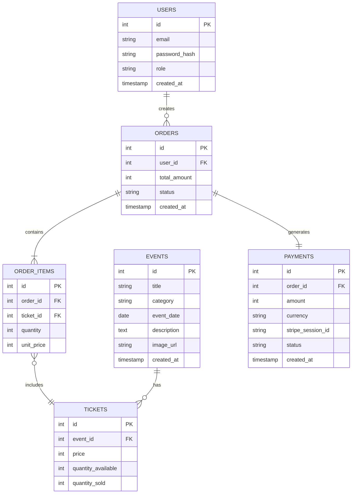
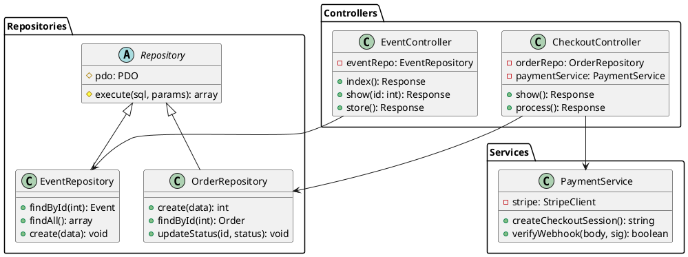
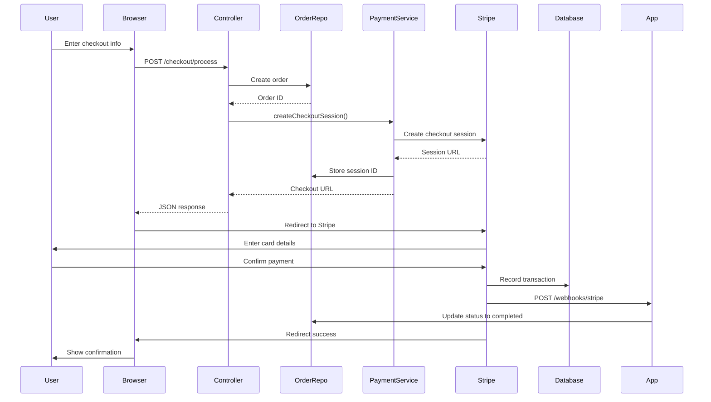

# Technical Documentation Guide (20% of Grade)

## 📋 Requirements

From rubric:
- **REQUIRED**: ERD (Entity Relationship Diagram) - complete database structure
- **REQUIRED**: UML class diagrams - code structure & relationships
- **BONUS**: Sequence diagrams (payment flow, checkout)
- **BONUS**: Activity diagrams (order process)
- **BONUS**: State diagrams (order lifecycle, payment status)

---

## 1. Entity Relationship Diagram (ERD)

### What It Shows:
- All database tables (entities)
- Columns (attributes) in each table
- Data types
- Primary keys (PK)
- Foreign keys (FK)
- Relationships (1:1, 1:N, N:N)
- Cardinality & multiplicity

### Haarlem Festival ERD Structure

```
┌─────────────────────┐
│     Users          │
├─────────────────────┤
│ PK: id              │
│ email (VARCHAR)     │
│ password_hash       │
│ role (VARCHAR)      │
│ created_at          │
└──────────┬──────────┘
           │ 1:N (User creates Orders)
           │
           ▼
┌─────────────────────┐
│     Orders          │
├─────────────────────┤
│ PK: id              │
│ FK: user_id         │
│ total_amount (INT)  │
│ status (VARCHAR)    │
│ created_at          │
└──────────┬──────────┘
           │ 1:N (Order has Items)
           │
           ▼
┌─────────────────────────┐
│   Order_Items          │
├─────────────────────────┤
│ PK: id                  │
│ FK: order_id            │
│ FK: ticket_id           │
│ quantity (INT)          │
│ unit_price (INT)        │
└─────────────────────────┘

┌─────────────────────┐
│     Events          │
├─────────────────────┤
│ PK: id              │
│ title (VARCHAR)     │
│ category (VARCHAR)  │
│ event_date (DATE)   │
│ description (TEXT)  │
│ image_url           │
│ created_at          │
└──────────┬──────────┘
           │ 1:N (Event has Tickets)
           │
           ▼
┌─────────────────────┐
│    Tickets          │
├─────────────────────┤
│ PK: id              │
│ FK: event_id        │
│ price (INT)         │
│ qty_available (INT) │
│ qty_sold (INT)      │
└─────────────────────┘

┌──────────────────────┐
│    Payments         │
├──────────────────────┤
│ PK: id               │
│ FK: order_id         │
│ amount (INT)         │
│ currency (VARCHAR)   │
│ stripe_session_id    │
│ status (VARCHAR)     │
│ created_at           │
└──────────────────────┘
```

### How to Create ERD Files:

#### Option 1: Draw.io (FREE, Easy)
1. Go to **https://draw.io**
2. Start new diagram
3. Search template: "ERD, Entity Relationship Diagram"
4. Drag & drop tables
5. Export as `erd.png` or `erd.drawio`
6. Save in project root

#### Option 2: Mermaid (In Markdown)


#### Option 3: SQL CREATE Statements (Alternative)
Document in `database/er_schema.sql`:
```sql
-- This shows schema = ERD in text form
CREATE TABLE users (
    id INT PRIMARY KEY AUTO_INCREMENT,
    email VARCHAR(255) UNIQUE NOT NULL,
    password_hash VARCHAR(255) NOT NULL,
    role ENUM('visitor', 'employee', 'admin') DEFAULT 'visitor',
    created_at TIMESTAMP DEFAULT CURRENT_TIMESTAMP
);

CREATE TABLE events (
    id INT PRIMARY KEY AUTO_INCREMENT,
    title VARCHAR(255) NOT NULL,
    category VARCHAR(100),
    event_date DATE NOT NULL,
    description TEXT,
    image_url VARCHAR(500),
    created_at TIMESTAMP DEFAULT CURRENT_TIMESTAMP
);

-- ... etc
```

---

## 2. UML Class Diagrams

### What It Shows:
- Classes (bold name box)
- Attributes (data members)
- Methods (functions)
- Visibility (+ public, - private, # protected)
- Relationships (inheritance, composition, association)

### Haarlem Festival UML Structure

#### Controllers Package
```
┌────────────────────────────────┐
│     EventController             │
├────────────────────────────────┤
│ - repo: EventRepository         │
├────────────────────────────────┤
│ + index(): Response             │
│ + show(id: int): Response       │
│ + store(data: array): Response  │
│ + update(id: int): Response     │
│ + delete(id: int): Response     │
└────────────────────────────────┘

┌────────────────────────────────┐
│   CheckoutController            │
├────────────────────────────────┤
│ - orderRepo: OrderRepository    │
│ - paymentService: PaymentService│
├────────────────────────────────┤
│ + show(): Response              │
│ + process(): Response           │
│ + success(): Response           │
│ + cancel(): Response            │
└────────────────────────────────┘
```

#### Repository Pattern
```
┌────────────────────────────────┐
│      Repository (Abstract)      │
├────────────────────────────────┤
│ # pdo: PDO                      │
├────────────────────────────────┤
│ # execute(sql, params): array   │
│ # queryOne(sql, params): ?array │
└────────────────────────────────┘
         △           △
         │           │
         │           └─────────────────┐
         │                             │
┌────────────────────┐    ┌─────────────────────────┐
│ EventRepository    │    │  OrderRepository        │
├────────────────────┤    ├─────────────────────────┤
│                    │    │                         │
├────────────────────┤    ├─────────────────────────┤
│ + findById(int)    │    │ + create(array)         │
│ + findAll()        │    │ + findById(int)         │
│ + create(...)      │    │ + updateStatus(...)     │
│ + update(...)      │    │ + getByUser(int)        │
│ + delete(int)      │    │                         │
└────────────────────┘    └─────────────────────────┘
```

#### Services
```
┌─────────────────────────────────┐
│    PaymentService               │
├─────────────────────────────────┤
│ - stripe: StripeClient          │
├─────────────────────────────────┤
│ + createCheckoutSession(): str   │
│ + verifyWebhook(): bool         │
│ + handleSuccess(): void         │
│ + getSession(id: str): array    │
└─────────────────────────────────┘
```

### Make UML Diagram:

#### Option 1: PlantUML (Free, Professional)

Create file: `docs/class_diagram.puml`


Then convert: `plantuml class_diagram.puml -o class_diagram.png`

#### Option 2: Draw.io (Visual)
1. Go to https://draw.io
2. Create new UML class diagram
3. Add classes with + - # notations
4. Draw associations with arrows
5. Export as PNG

### UML Essential Elements

```
Class Name (Bold)
┌─────────────────────┐
│  MyController       │ ← Class name (bold)
├─────────────────────┤
│ - private: string   │ ← Visibility: - = private
│ + public: int       │ ← Visibility: + = public
│ # protected: bool   │ ← Visibility: # = protected
├─────────────────────┤
│ + doThis(): void    │ ← Method with return type
│ - calculate(): int  │
│ + save(data): bool  │
└─────────────────────┘

Relationships:
●──► (Association)
◆──► (Composition - strong)
◇──► (Aggregation - weak)
──▶ (Inheritance - child → parent)
```

---

## 3. BONUS: Sequence Diagrams (Payment Flow)

### What It Shows:
- Interaction between classes/actors over time
- Message flow (method calls)
- Order of operations

### Payment Processing Sequence
```
Actor       Browser         Controller        Service         Stripe          DB
(User)        │                │                 │              │              │
  │           │                │                 │              │              │
  ├──Submit──→│                │                 │              │              │
  │           │                │                 │              │              │
  │           ├──POST/checkout process──────────→│              │              │
  │           │                │                 │              │              │
  │           │                │                ─┼─ Get order ─→│              │
  │           │                │                 │←─ Order ─────┼              │
  │           │                │                 │              │              │
  │           │                │      Create Stripe Session    │              │
  │           │                │ ───────────────────────────────→│              │
  │           │                │                 │← Session ID ─┤              │
  │           │                │                 │              │              │
  │           │← Checkout URL ─┤                 │              │              │
  │           │      (Stripe)  │                 │              │              │
  │           │                ├─ Store Session ─┼──────────────┼─────────────→│
  │           │                │                 │              │              │
  │←─Redirect─│                │                 │              │              │
  │   (Stripe)│                │                 │              │              │
  │           │                │                 │              │              │
```

### Create Sequence Diagram

**Option: Mermaid**


---

## 4. BONUS: Activity Diagram (Checkout Process)

### What It Shows:
- Flow of activities
- Decision points (diamonds)
- Parallel activities
- Error handling

```
                    Start
                      │
                      ▼
              User visits cart
                      │
                      ▼
         Is cart empty? ──→ Yes → Show empty message
              │                        │
              No                       ▼
              │                    End (error)
              ▼
        Click checkout
              │
              ▼
      Is user logged in? ──→ No → Redirect to login
              │                        │
              Yes                      ▼
              │                    Login page
              ▼                       │
        Display review          ┌──────┘
              │                 ▼
              ├──────────→ Resume checkout
              │
              ▼
      User confirms order
              │
              ▼
      Create order in DB
              │
              ▼
    Create Stripe session
              │
              ▼
    Redirect to Stripe
              │
              ▼
      User enters payment
              │
              ├─────→ Payment fails ──→ Retry
              │
              Payment succeeds
              │
              ▼
         Webhook calls API
              │
              ▼
      Update order status
              │
              ▼
      Send confirmation email
              │
              ▼
       Show success page
              │
              ▼
             End
```

---

## 5. BONUS: State Diagram (Payment Lifecycle)

### What It Shows:
- States an object can be in
- Transitions (arrows) between states
- Triggers for transitions

```
        ┌─────────────┐
        │   PENDING   │◄──┐ User creates order
        └──────┬──────┘   │
               │          └─ Initial state
               │ User submits payment
               ▼
        ┌──────────────┐
        │  PROCESSING  │
               │
      ┌────────┴────────┐
      │ (timeout/error) │
      ▼                 ▼
   ┌──────┐      ┌────────────┐
   │FAILED│      │ AUTHORIZED │
   └──┬───┘      └──────┬─────┘
      │                 │
      │             payment captured
      │                 │
      │                 ▼
      │          ┌────────────┐
      │          │ COMPLETED  │
      │          └────────────┘
      │                 │
      └────────┬────┴───┴─────┬─────────┐
               │              │         │  
         (timeout)    (customer refund) (error)
               │              │         │
               ▼              ▼         ▼
            ┌──────────────────────────────┐
            │         EXPIRED/              │
            │      REFUNDED/FAILED          │
            └──────────────────────────────┘
```

---

## Documentation Checklist

### REQUIRED (80% of 20% = 16%):
- [ ] **ERD.png** or **erd.drawio**
  - All tables shown
  - All columns listed
  - PK/FK marked
  - Relationships shown
  - Cardinality noted

- [ ] **UML_ClassDiagram.png** or **.puml** file
  - All main classes shown (Controller, Repository, Service)
  - Attributes with types
  - Methods with signatures
  - Relationships/inheritance shown
  - Visibility modifiers (+, -, #)

### BONUS (4% extra each):
- [ ] **Sequence Diagram** (Payment flow)
- [ ] **Activity Diagram** (Checkout process)
- [ ] **State Diagram** (Order/Payment states)

---

## Tools Recommended

| Tool | Cost | Ease | Quality |
|------|------|------|---------|
| Draw.io | Free | Easy | Good |
| PlantUML | Free | Medium | Excellent |
| Mermaid | Free | Easy | Good |
| Lucidchart | Paid | Easy | Excellent |
| Visual Studio | Free IDE | Hard | Good |

**Recommendation**: Use **Draw.io** + **Mermaid** (free & easy)

---

## Export Format

Save in project:
```
documentation/
├── ERD.png
├── ClassDiagram.png
├── SequenceDiagram.png (bonus)
├── ActivityDiagram.png (bonus)
└── StateDiagram.png (bonus)
```

Or embed in markdown:
```markdown
## Architecture

### Entity Relationship Diagram


### Class Structure


### Payment Sequence

```

---

## Final Documentation Submission

Create `TECHNICAL_DOCUMENTATION.md`:
```markdown
# Technical Documentation - Haarlem Festival

## 1. Entity Relationship Diagram (ERD)

[Include ERD.png]

The system consists of 6 main entities:
- **Users**: Stores user accounts (VISITOR, EMPLOYEE, ADMIN roles)
- **Events**: Concert/performance events...
- **Tickets**: Specific ticket types...
- **Orders**: Purchases...
- **Order Items**: Line items in purchases...
- **Payments**: Payment records via Stripe...

## 2. UML Class Diagrams

[Include ClassDiagram.png]

### Controllers
- EventController: Handles event display/management
- CheckoutController: Manages shopping process

### Repositories
- Repository (abstract base): PDO connection handling
- EventRepository, OrderRepository, etc: Specific data access

### Services
- PaymentService: Stripe integration

## 3. Request Flow Example

[Include SequenceDiagram.png if bonus]

...

## 4. Checkout Process

[Include ActivityDiagram.png if bonus]

...

## 5. Payment States

[Include StateDiagram.png if bonus]

...
```

Submit everything = **20% + bonuses = 24%+ achieved!** ✨

